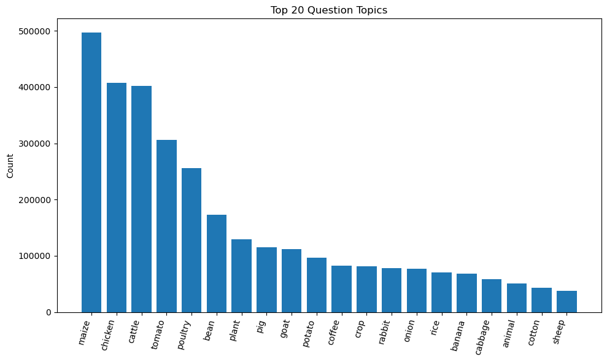

# DataKind - Smallholder Farmers DataKit - Clustering Analysis
**Author:** Brandon Rugg  
**Date:** November 2025

## Introduction
Producers Direct is a nonprofit organization that supports a 1M+ network of smallholder farmers in efforts to build more sustainable and profitable farms in South America and Africa. Previously, producers Direct acquired a large dataset from WeFarm, an SMS-based platform that operated for 7 years before going bankrupt in 2022. This 7GB dataset consists of over 5M questions, 16.2M responses, and extensive metadata for each message.

In November 2025, DataKind launched a month-long initiative to help Producers Direct determine what actionable information can be obtained from these farmer-to-farmer SMS messages. Insights gathered will hopefully aid Producers Direct in reestablishing a peer-to-peer network for smallholder farmers.

Main Project Repo: https://github.com/datakind/datakit-smallholder-farmers-fall-2025
Project Brief: https://docs.google.com/document/d/1jKTmb8R5GlM9uqQkB5fXd37o2bdX17JKB36mK-NqWFE/edit?tab=t.0

## Project Goal
This subset of the November 2025 DataKit focuses on learning how the platform was used-- in other words, what were the farmers asking? There are already approximately 150 topic tags included in the data, but all of them are related to specific types of crops or livestock, as shown in this bar plot of the top 20 most common question tags:

There is undoubtedly a lot of structure that these tags aren't covering.
* The top 3 tags account for 24% of the questions, and 1,537,291 questions (another 28% of the data) are not tagged at all.
* Questions have at most one tag.
* There are no tags for things like finance, planning, farm equipment, or questions about how the WeFarm platform worked.

I performed a clustering analysis to see if I could uncover common topics the farmers were asking about, so that Producers Direct could make sure their needs are being met moving forward. More in depth topic labeling may also help uncover patterns in seasonality, identify domain experts, and identify common financial inclusion related topics.

