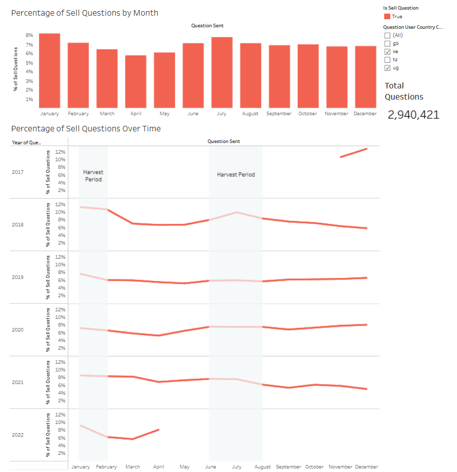
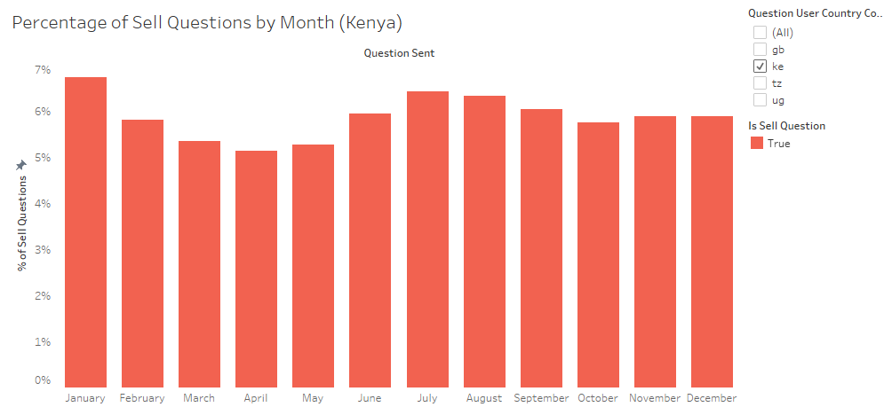
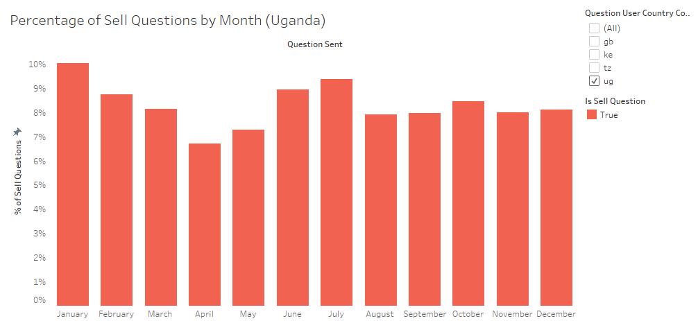
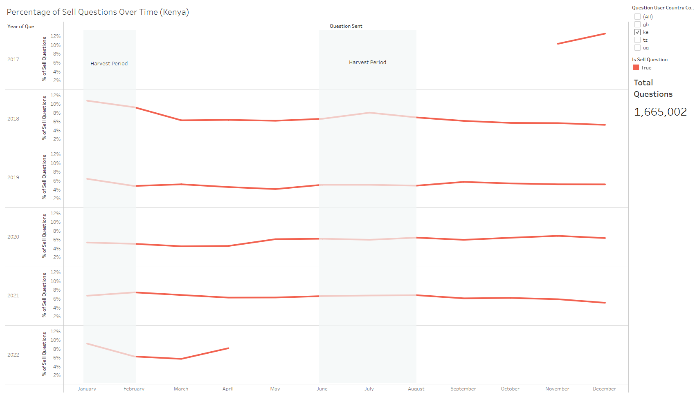
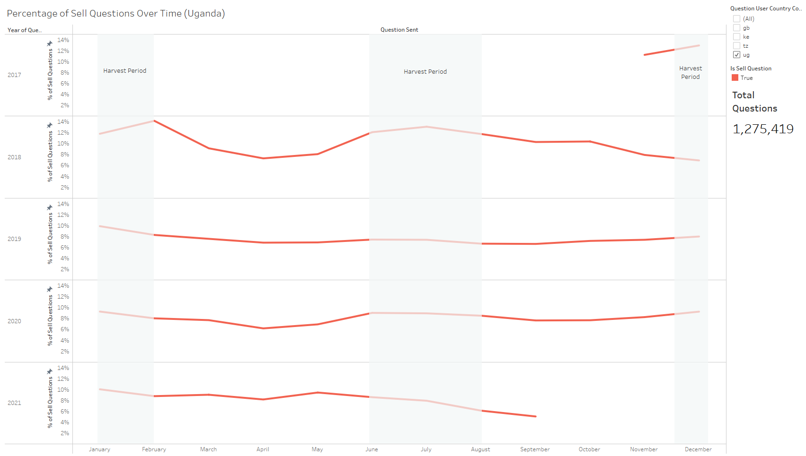

# Project Background

In this analysis, I wanted to answer the question of whether it was possible to map the farming calendar based on the types of questions being asked at certain times. The insights found primarily utilized the following data:

- Questions Asked: What was being asked by farmers and what key words were being used
- Time asked: The day, moth, year of when each question was asked
- Country: The geographical location from which the question came from

The majority of the data cleaning and analysis was done using Python with visualizations compiled using Tableau.

# Data Used

This analysis only uses the dataset provided by DataKind

# Summary

The following insights have been noted:

- Questions related to selling and general market related questions were found to be asked more frequently during harvest periods
- Similar relationship between market questions asked and time of year were found in both Uganda and Kenya
- The ratio of market-related questions and non market-related questions saw significant change each year

# Insights Deep Dive

By analyzing key word similarities, I was able to determine which questioned were likely related to be asking about selling goods. By labelling these questions, I could analyze the percentage of these questions compared to all other quesitons asked. I first wanted to know which months saw the highest percentages of market related questions. What I found was that the ratio of market related quesitons was higher during peak harvest months for both Uganda and Kenya. We were informed that in Kenya the harvest months ranged was from January-February and June-August while Uganda harvest periods were from December-February and June-August. It was found based on the graphs below that the where questions related to selling were most concentrated were in January and July for both Kenya and Uganda. This is what was expected as both Kenya and Uganda have similar harvesting periods, and farmers would be likely to want to sell harvested crops during harvest season. Crucially, this noticably relationship between the concentration of market related questions and harvest period times supports the idea that the farming calendar can be mapped based on the types of questions being asked.

When zooming in on this analysis and comparing by year, we can see that similar trends occur each year. When analyzing data for Uganda, the years 2018 and 2020 in particular have clear peaks in the concentration of selling related questions during harvest periods. Years 2017 and 2019 don't have as prominent of a correlation, but still have the two months with the highest concentration of market related questions fall within both harvest periods. 2021 saw this peak occur in May for reasons unknown, but may possibly have been related to unique weather and harvesting times that year. When analyzing the same data for Kenya, less of a correlation is present and the concentration of market based quesitons is much more stable throughout the calendar year. Some years, particularly 2018, still exhibit this correlation. It is possible Kenya has more varying harvest periods depending on the crop, but the reasons for the slight differences in question concentration between Uganda and Kenya are currently unclear.

# Analysis Process

The code for this analysis can be found in the 'Question Similarity Analysis.ipynb' notebook.

Requirements:

pandas                            2.2.3

nltk                              3.9.1

pyenchant                         3.3.0

matplotlib                        3.10.0

wordcloud                         1.9.4

spacy                             3.8.11

en_core_web_lg                    3.8.0

gensim                            4.4.0

### Data Cleaning and Analysis Steps

#### A: Data Cleaning
1. Import data
    - This analysis utilizes Python and Jupyter Notebook. The pandas library was used for importing and cleaning data. Data was filtered to only include questions in english
2. Remove unecessary columns
    - Here we will only keep columns relating to the question asked, including the question itself, time, and location asked. We will remove question topic as well, as we will attempt to categorize the data seperately
3. Clean question_content column
    - Change all text to lowercase
    - Remove Punctuation and Stopwords
    - Tokenize and Lemmatize Text

#### B: Analysis

4. Count total occurances of each used word, remove numbers and non-english words
    - Here the amount of times each word occurs within all the questions is calculated. We will use the 'enchant' package to also filter out any words that are not english words (it is important to note that this also eliminates typos, a spellchecker could potentially also be used to prevent this).
5. Rank occured words by similarity
   - The 'spacy' and 'en-core-web-lg' packages to calculate cosine similarity of each word to a target word. The target word in this analysis is simply 'sell'. This should give words that relate closely to the selling of things. We will only take the top 25 most similar words as this should exclude questions not related to markets and provide enough data to understand the relationship over time.
6. Label questions based on word similarity
   - If a question contains a word in the top 25 most similar words, we will label is as being a question related to selling or markets. Visualizations will be made with the new labelled data.

# Further Questions:

- Could this analysis include trends for specific crops?
- How would this analysis appear for questions related to other stages in the farming lifecycle including growing, pest control, and harvesting?

# Things That Did Not Work and Works in Progress

- I unfortunately ran out of time, but I would be very interested to try this type of analysis for the rest of the farming lifecycle outside of market related questions including planting, pest control, and harvesting. It would likely only require minor tweaking of the key words used to identify the question topic. 
- Another part of this analysis includes the 'LDA Topic Labeling.ipynb' notebook. Here I attempted to create an LDA model to categorize questions to determine if there were clusters of similar questions being asked. Using this technique ended up resulting in a low coherence score likely due to the low size of the questions asked and as a result could not be used with sufficient accuracy. Using alternative techniques or refining the process could result in achieving a more sufficient topic coherence.
