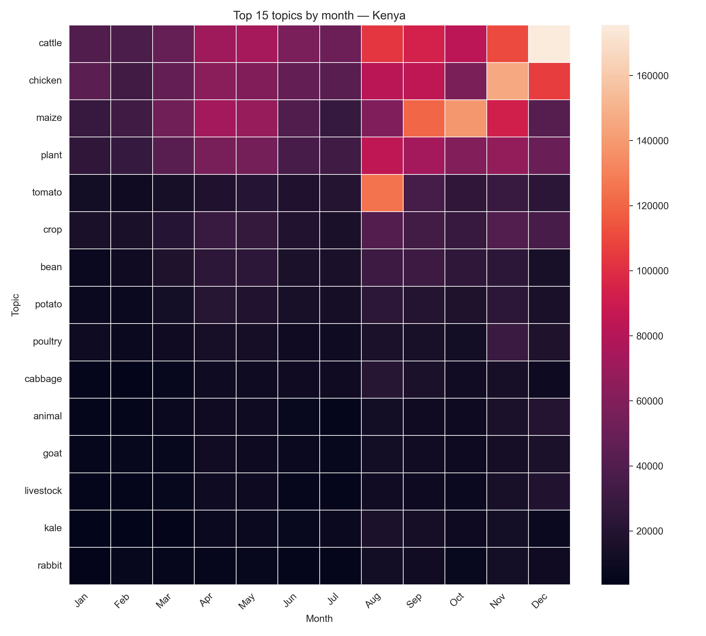
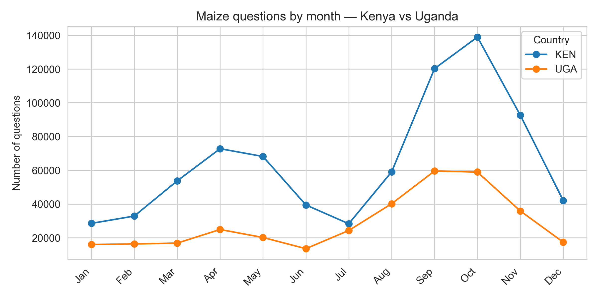
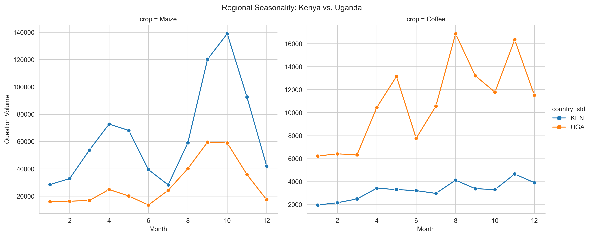
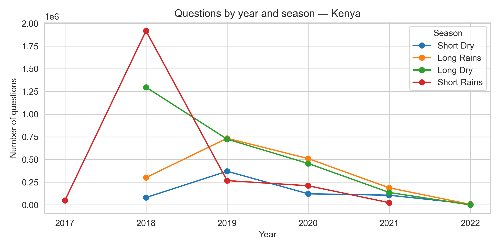
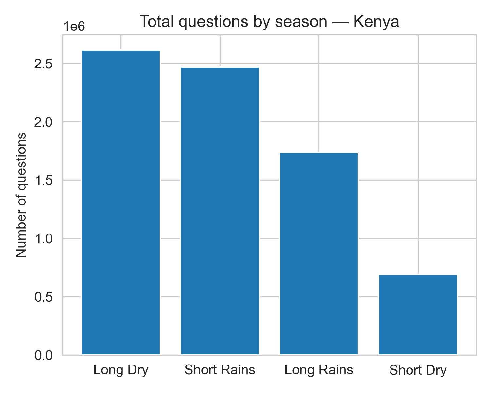
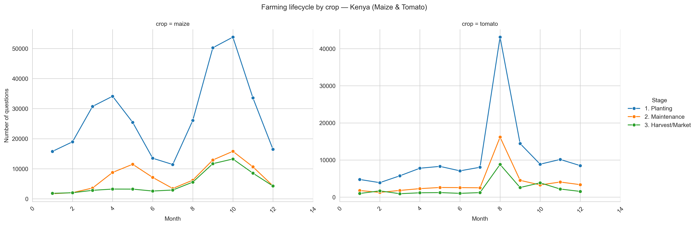

# Vu Nguyen Hoang – Challenge 2: Seasonality

## Overview
This contribution addresses **Challenge 2 – Seasonality** from the Producers Direct 
DataKit. The goal is to understand when farmers ask for advice on different crops 
and topics, and how this aligns with the **East African farming seasons**. Better 
understanding of question seasonality can help Producers Direct:

- plan timely content and advisory campaigns,

- anticipate peaks in demand for specific topics or crops, and

- refine tools for early warning and planning (e.g. pest outbreaks, planting windows).

The analysis focuses primarily on **Kenya** (English questions) with **Uganda** 
used for regional comparison, reflecting both language coverage and data quality 
constraints.
___

## Research Questions
1.  **How do question types (e.g. planting, pests, harvesting, markets) fluctuate by 
    month or season?**

    → Focus: topic-level monthly and seasonal patterns within Kenya.

2. **Do these patterns change over time or by region?**

    → Focus: compare Kenya and Uganda (mainly maize and livestock) and examine 
      trends from 2017 to 2022.

3. **Is there an association between question data and farming season?**

    → Focus: link overall question volume and topic mix to the four main 
      farming seasons and test this statistically.
___
## Methodology

### Data Sources
**Datasets**
* WeFarm Dataset provided by Producers Direct: 20M+ rows of SMS interactions (2015-2022).
* Scope: Filtered to ~12M rows focusing on Kenya (KEN) and Uganda (UGA).

**Community/Volunteer Resources** 
- Initial EDA notebook provided by G. Lewis.
- Translation / Keyword list provided by B. Noyes.
- DataKit brief and WeFarm data dictionary as public documentation.

### Data Preprocessing
1.  **Filter & store as Parquet** 
    
    Used `DuckDB` to convert raw CSV to Parquet
    for performance, then filtered to English questions and standardised 
    country codes and wrote the result into a compressed Parquet file:
    ````
    COPY (
    SELECT
        question_id,
        CAST(question_sent AS TIMESTAMP) AS q_date,
        question_body AS q_text,
        question_topic,
        question_user_status,
        CASE
            WHEN LOWER(question_user_country_code) = 'ke' THEN 'KEN'
            WHEN LOWER(question_user_country_code) = 'ug' THEN 'UGA'
            WHEN LOWER(question_user_country_code) = 'tz' THEN 'TZA'
            ELSE question_user_country_code
        END AS country_std
    FROM read_csv_auto('.../producers_direct_raw_data.csv', sample_size=-1)
    WHERE LOWER(question_language) IN ('eng', 'en')
    ) TO 'data/processed/wefarm_data_english_v2.parquet' (FORMAT PARQUET);

2.  **Derived time and season fields** 

    Extracted `year` and `month_num`from `q_date`and adapted season buckets:
    - `Short Dry`= Jan–Feb
    - `Long Rains` = Mar–May
    - `Long Dry` = Jun-Sep
    - `Short Rains` = Oct-Dec


3. **Topic Handling**  
    
    From `question_topic`, `NULL`or missing topics were treated as 
    `"Unknown"`. For some analysis, `"Unknown"`were dropped. For 
    detailed plots, a focus were put on top 15 topics by volume in Kenya.


4. **Farming calendar classification (Kenya, maize & tomato)**
    
   A simple regex-based "intent" label from the English text + a few 
    Swahili keywords for Planting, Maintenance and Harvest/Market was
    constructed, then finally the counts were aggregated by 
    `month_num x crop x stage` for maize and tomato.

### Tools and Technologies
* Python 3.13.0
* **Key libraries:** 
    - `duckdb`, `numpy`
    - `matplotlib`, `seaborn`
    - `scipy.stats`
* **Environment:** 
    - `Jupyter Notebook` / PyCharm
___
## Use of Generative AI
**Tools used:** 
* **ChatGPT**
  - Paraphrasing text for more comprehension in notebook, README 
             and report.
  - Code Debugging and Code Optimization.


* **Human Review:** 
    - All AI-generated content were adapted and checked by me.
    - Results were cross-validated with the community in Slack.
    - Strategic decisions were met by me, like the choice of focus
      (Kenya & Uganda for countries, English as language) or interpretation
        of results.
___
## Key Findings

**Finding 1: Topic seasonality is strongest in the second half of the year 
(Kenya)**

- In the Kenyan English subset, about **89 %** of questions have a specific 
    `question_topic`; **11 %** are labelled `"Unknown"`. The detailed analysis 
    focuses on the **top 15 topics**.

- The topic × month heatmap shows that most activity is concentrated 
 in the **second half of the year**:



  - For **cattle, chicken, maize, plant and tomato**, volumes are low from 
    Jan–Jul, then rise sharply from Aug onwards, with peaks in Oct–Dec 
    (short rains).

  - A smaller bump around Mar–May (long rains) appears for maize and general
  “plant” questions.

- Seasonal shares for key topics (Kenya):

    - **Cattle:** ~39 % of questions in short rains, 32 % in long dry, 21 % in 
        long rains.
    - **Chicken:** ~38 % in short rains, 32 % in long dry.
    - **Animal**: ~38 % in short rains, 29 % in long dry, 24 % in long rains.

**Implications**

- Advisory content on livestock and major crops should be prioritised 
    in Aug–Dec, with special emphasis on Oct–Dec.

- A secondary push around Mar–May can support planting decisions during 
  the long rains.
___
**Finding 2 – Kenya and Uganda show similar maize seasonality but different 
magnitudes**

- When comparing maize questions by month for Kenya vs Uganda:


    - Both countries exhibit rising volumes from March, strong peaks in 
        Sep–Oct, and declines in Nov–Dec.

    - Kenya has much higher absolute volumes; Uganda’s pattern is smoother 
      and somewhat more evenly spread.

- Seasonal shares for maize:

    - Kenya: roughly 35 % short rains, 32 % long dry, 25 % long rains, 
        8 % short dry.

    - Uganda: maize questions are also concentrated in long dry + short rains,
      but shares are more balanced and total counts are lower.

**Implications**

- A shared content calendar for maize across Kenya and Uganda is feasible, 
    especially for the Sep–Oct peak.

- Localised interventions in Uganda may gain more from improving reach 
  (volume) than changing timing, since timing already broadly aligns with 
  Kenya.
___
**Finding 3 – Questions are strongly associated with farming seasons**

- Aggregating all Kenyan questions by season shows that usage is far from 
    uniform:

    - ~9 % in Short Dry (Jan–Feb)

    - ~23 % in Long Rains (Mar–May)

    - ~35 % in Long Dry (Jun–Sep)

    - ~33 % in Short Rains (Oct–Dec)

  → Almost 70 % of all questions occur during Long Dry + Short Rains, when many crops are in critical growth or harvest/marketing stages.

- A chi-square test on a contingency table of season × topic for maize, 
  cattle, chicken and tomato yields:

    - χ² ≈ 90,315, p-value < 0.001.

    - This rejects the null hypothesis of independence and confirms that 
    certain topics are strongly concentrated in specific seasons.

**Implications** 

- Seasonal planning should be treated as a core design dimension of the 
    advisory platform, not a cosmetic one.

- Topic-season associations can be used to:

    - schedule push messages,

    - tailor FAQ surfacing in the app,

    - forecast support load per topic by season.
___
**Finding 4 – A simple farming calendar emerges for maize and tomato (Kenya)**

- Using regex-based classifiers, maize and tomato questions in Kenya were 
  grouped into:

    - Planting, Maintenance, and Harvest/Market stages.



- For maize:

    - Planting questions increase from Jan, are elevated in Mar–Apr 
      (long rains), and peak strongly in Oct (short rains).

    - Maintenance and harvest/market questions remain modest in the first half 
      of the year but rise from Jun onwards, peaking in Oct.

- For tomato:

    - Planting, maintenance and harvest questions all spike in Aug, 
      indicating a more compressed seasonal window.

**Implications**

- Even with simple rules, question intent can support a crop-specific calendar.

- These rules could be refined or use NLP models to:

    - flag time-sensitive questions,

    - align extension content and training with actual farmer activity phases.
___
## Limitations and Challenges

**Data Limitations**

- Analysis is restricted to English questions. Tanzania and many Swahili-only
  interactions are therefore not fully represented.

- The question_topic field is sometimes missing or inconsistent:

    - ~11 % of Kenyan questions are Unknown.

    - A more robust topic taxonomy or manual re-labelling might improve 
    accuracy.

**Methodological limitations**

- Season definitions use fixed month ranges; real rainy seasons can shift 
  by region and year.

- The intent classifier for maize and tomato is rule-based and simple:

    - sensitive to spelling and language variation,

    - does not capture complex multi-intent questions.

- The chi-square test shows association but not causality; other factors 
  (e.g. pests, market shocks) could drive spikes.

**Technical challenges**
- Handling the full 7GB CSV inside a notebook is non-trivial; the 
  Parquet + DuckDB approach was chosen to stay within laptop RAM limits.

- NLP methods (e.g. topic modelling on free text) were not applied due to 
  time and compute constraints, even though they could add depth.
___
## Next Steps and Recommendations

**For further analysis**

**1. Include Swahili and Tanzanian data**

- Apply multilingual NLP models or manual mapping to bring non-English 
      questions into the same topic framework.

**2. Refine topic and intent classification**

- Move from rule-based classifiers to supervised or semi-supervised models 
  trained on a small hand-labelled subset.

- Harmonise topics across countries and languages.

**3. Link to external seasonal data**

- Integrate rainfall, temperature, and official crop calendars to validate 
  whether question peaks precede, coincide with, or follow key agronomic 
  events.

**For Decision Makers**

**1. Season-aware content planning**

- Use the Long Dry + Short Rains dominance and topic-season shares to 
  schedule campaigns for maize and livestock.

**2. Operational forecasting**

- Anticipate support load by topic and season to staff digital extension 
  services effectively.

**3. Data improvements**

- Encourage better topic tagging and language metadata at collection time.

- Consider adding structured fields for crop stage or question intent to 
  reduce reliance on free-text parsing.
___
## Files in This Contribution
```
Vu_Nguyen_Hoang/
├── README.md                # This file
├── requirements.txt         # Python environment
├── data/
│   ├── raw/
│   │   └── producers_direct_raw_data.csv        # Original WeFarm export (not committed to GitHub)
│   └── processed/
│       └── wefarm_data_english_v2.parquet       # English-only subset created via DuckDB
├── notebooks/
│   └── seasonality_analysis.ipynb               # Main analysis notebook                       # Report
└── visualizations/
    ├── 01_topic_heatmap_KEN.png
    ├── 01_topic_heatmap_KEN_top15.png
    ├── 02_maize_kenya_vs_uganda.png
    ├── 02_regional_comparision.png
    ├── 02_year_season_trend_KEN.png
    ├── 03_crop_calendar.png
    └── 03_total_by_season_KEN.png
```
___
## Contact and Collaboration

- Author: Vu Nguyen Hoang

- GitHub: @VuNguyenHoang

- Slack: Vu Nguyen Hoang

I’m happy to receive feedback, suggestions, or ideas for extending this 
analysis. :)
___
## Acknowledgments

- Thanks to the Producers Direct and DataKind teams for providing the data 
  and challenge framing.

- Thanks to fellow volunteers for:

    - the initial EDA notebooks that helped validate aggregate numbers,

    - the Swahili keyword list used in the farming calendar rules,

    - and general discussion on seasonality and modelling approaches in the 
      shared workspace on Slack.

- This work builds on the broader community effort around the Producers Direct 
  DataKit.

Last updated: December 2025 – Status: Challenge 2 Completed!

