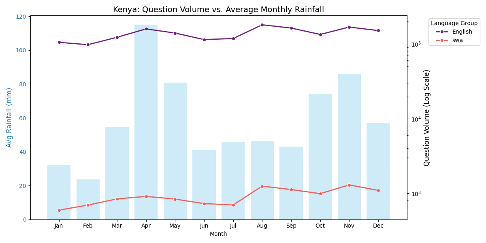
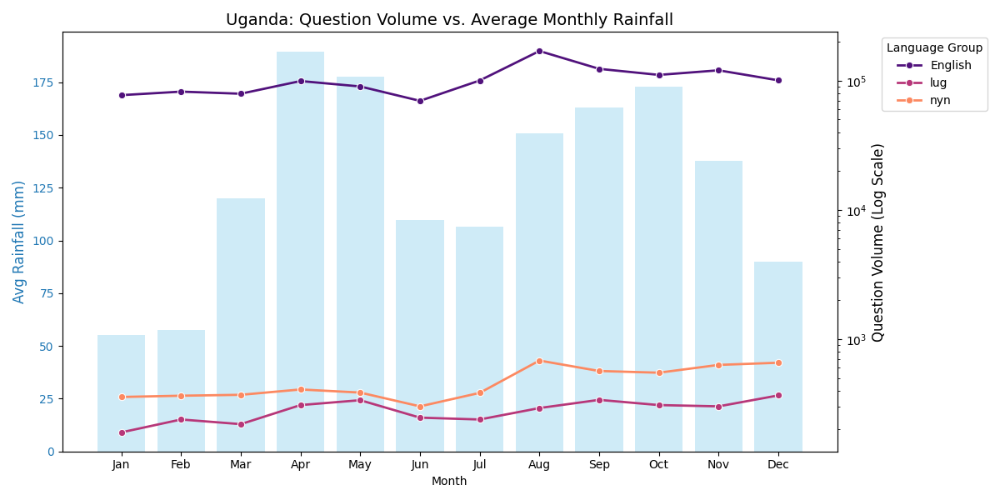
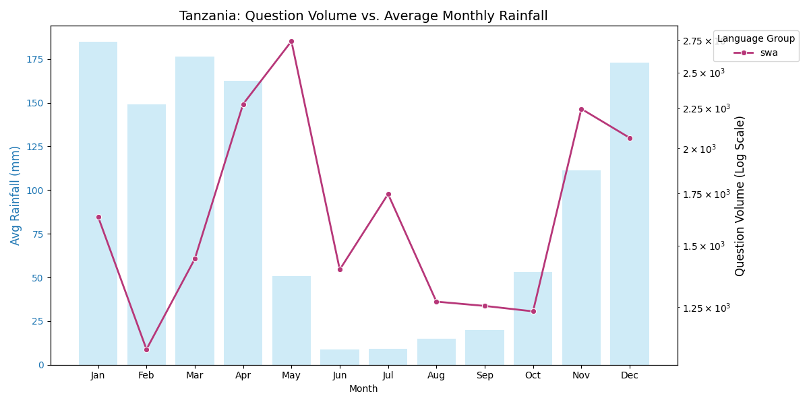
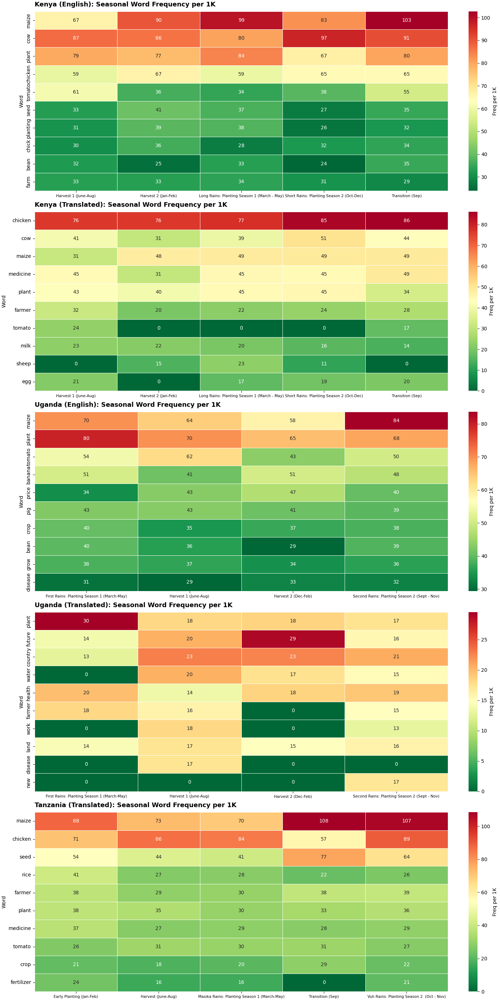

# Allison Sibrian - Challenge 2 Analysis

## Overview
This project analyzes the seasonality of farmers' questions across Kenya, Uganda, and Tanzania. By correlating farmer question volume with ERA5 weather data and performing NLP keyword analysis on a split dataset (English vs. Local Languages), I identify distinct seasonal keywords for each region.

## Research Questions
- Question 1: Do farmer questions align with their countries' farming seasonal calendar?
- Question 2: Can we identify distinct seasonal farming words for each country based on farmer question data? 
- Question 3: How does language (English vs. Local Languages (Swahili, Luganda, Ryunakole)) influence the types of seasonal questions asked?

## Methodology

### Data Sources
- Producers Direct Dataset: Obtained de-duplicated farmer questions split by language (English, Swahili, Luganda, Runyankole).
- ERA5 Climate Reanalysis Data: Monthly aggregates for Total Precipitation (prcp), Maximum Temperature (tasmax), and Minimum Temperature (tasmin) for Kenya, Uganda, and Tanzania.

### Approach
1. **Step 1**: Data Splitting: Created two comparison groups: The English Group (Kenya/Uganda baseline) and the Local Language Group (Stratified sample of Swahili, Luganda, Runyankole languages).
3. **Step 2**: Weather Validation: Overlayed ERA5 precipitation data against each country and group question volume to compare farmer question volume to climate events.
5. **Step 3**: NLP & Cleaning
6. **Step 4**: Keyword Extraction
7. **Step 5**: Heatmap Visualizations

### Tools and Technologies
- **Programming Language**: Python 3.11
- **Key Libraries**: pandas, numpy, matplotlib, seaborn

## Key Findings

### Farmer Question Volume Peaks (English and Translated Group) during Harvest and Short Rains (vs. Long Rains)
Overlaying the ERA5 data with each country's farmer questions reveals when question volume spiked in relation to precipitation data.

For Kenya's English and Translated Group: 
- Question Volume is at its maximum peak for the Kenya English Group dataset in August, followed by November and September (aligning with the end of the Harvest 1 and entering the Short Rains: Planting Season 2. 
- Question Volume is at its maximum peak for the Kenya English Translated dataset in November, followed by August and September.
  
Although November falls under the Short Rains season, this month shows a large amount of precipitation for the second half of the year. Higher question volume aligns with the end of the Harvest 1 period for Kenya. 

For Uganda's English and Translated Group:
- Similar to Kenya, Question Volume is at its maximum peak for the Uganda English Group dataset in August, then followed by November and September (aligning with the end of Harvest 1 and entering the Second Rains: Planting Season 2).
- Question Volume is at its maximum peak for the Uganda Translated Group dataset in August, followed by December and November.
  
However, unlike Kenya, most of Uganda's question volume tends to fall during Uganda's Second Rains.

For Tanzania:
- Question Volume is at its maximum peak for the Tanzania dataset (only Translated data was utilized as the English dataset did not contain a significant amount of data) in May, followed by April and November (aligning with Tanzania's Masika rains and Vuli Rains (Nov)).

It seems that question volume is concentrated towards the end of the Masika Rains (Apr-May) and towards the end of the Vuli Rains season.

**Implications for Producers Direct:**
- Question volume in Kenya and Uganda is highest in the second half of the year (August–November), rather than the first. This suggests that farmers are actively seeking information to prepare for the "Short Rains." Similarly, Tanzania sees high activity at the end of the Masika Rains season. These specific seasonal periods should be treated with more attention as user engagement happened the most during this time.
- It would be helpful to inspect the questions during this time and push for resource services, such as land preparation, to address farmer needs.

### Distinct Seasonal Keywords Per Country
Creating a heatmap of each country's seasonal keywords displays the correlation between specific topics and the current farming cycle. 

For Kenya's English and Translated Group: 
For both groups, 'Maize', 'Cow', and 'Chicken' appear as the top 3/4 most frequent keywords.

- Maize topics tend to have a higher frequency (per 1K words) during the Transition period (September), the Second Planting Season (Oct-Dec), and during Harvest 2 months (Jan-Feb)
- Cow topics also seem to dominate around the short rains (Oct-Dec) and the Transition period in September.
- Chicken topics are notably higher in the Translated dataset, peaking during the Short Rains.

For Uganda's English and Translated Group: 
While the Translated group contained higher non-agricultural noise, the combined view reveals 'Maize', 'Plant', 'Tomato', and 'Water' as top keywords.

- Maize topics dominate the Second Rains: Planting Season 2 (Sept-Nov).
- Plant topics occur more frequently during the First Rains: Planting Season 1 (March-May), suggesting that farmers may be asking about crop selection and planting decisions for the current season.
- Tomato topics dominate Harvest 1 season (June-Aug)

For Tanzania:
Similar to Kenya, 'maize' and 'chicken' are the top 2 frequent words, but 'seed' also tends to dominate.

- Maize topics are most frequent during the Transition (September) months and the Vuli Rains Planting Season 2 (Oct-Nov).
- Chicken topics occur most during the Vuli Rains and the Harvest season (June-Aug).
- Seed topics mostly dominate the Transition and Vuli Rains period. 

**Implications for Producers Direct:**
- Since 'Maize' and 'Chicken' dominate simultaneously, this serves as a baseline to investigate whether farmers are practicing integrated mixed farming 
- Specific seasonal keywords like 'Tomato' (Uganda) and 'Seed' (Tanzania) suggests further investigation whether questions are about needs for specific agricultural/crop support. It would be helpful to organize the platform's questions by a crop category.

## Visualizations

### Rainfall vs. Question Volume

**Interpretation**: 
This visualization shows the ERA5 overlay on farmer question volume.

- Question Volume tends to peak during the second half of the year (Kenya/Uganda), while it peaks during the Masika Rains for Tanzania.

### Regional Heatmap

**Interpretation**: 
This heatmap displays the Top 10 word frequencies per region, identifying distinct seasonal keywords.

- This visualization confirms that while 'Maize' and 'Plant' are dominant keywords, there are still distinct regional differences: 'Rice' and 'Seed' appear in Tanzania, while 'Tomato' appears in Uganda.

## Limitations and Challenges

### Data Limitations
- The Uganda (Translated) dataset contained significant non-agricultural noise (e.g., "future", "seat", "ministry"), resulting in a higher non-agricultural frequency compared to the English dataset.
- The English dataset is larger than the Local dataset, requiring normalization (Frequency per 1K) to allow for visual comparison.

## Next Steps and Recommendations

### For Further Analysis
1. Improve upon translation by utilizing stronger translation models validated by local users to reduce noise, and implement Topic Modeling (LDA) to identify any themes that stick out.
2. Expand analysis to utilize the whole dataset instead of the current 0.5% translated samples and whole English dataset.

### For Producers Direct
1. Data shows question volume peaks during the harvest and transition periods rather than the primary planting season. Producer's Direct should investigate questions during this season and be ready to prioritize post-harvest handling and second-season preparation to meet farmers' needs.

## Contact and Collaboration

**Author**: Allison Sibrian
**GitHub**: @allisonsibrian

**Collaboration Welcome**: 
- Open to feedback and suggestions
- Happy to collaborate on related analyses
- Available to answer questions about this approach

## Acknowledgments
- Built upon work by Conrad Keyclamp's heatmap visualizations in Challenge 2

---

**Last Updated**: December 4, 2025
