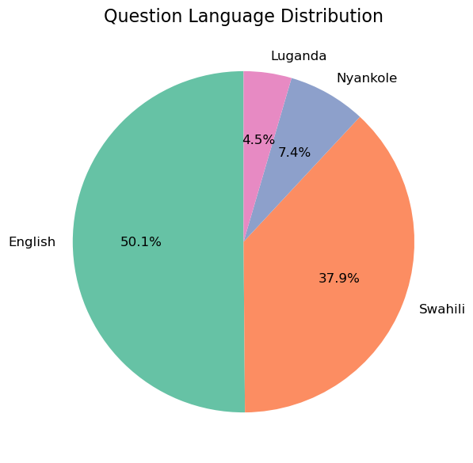
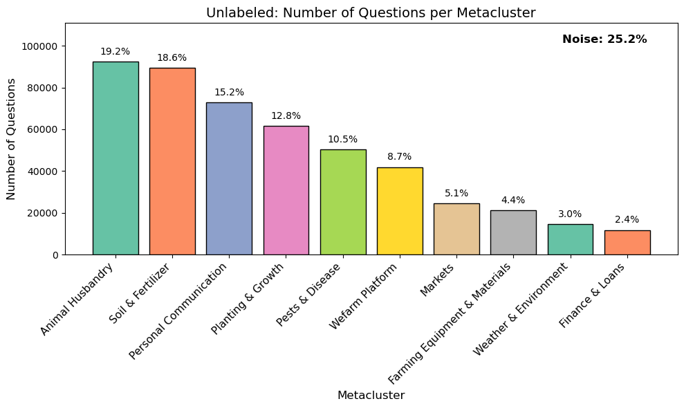
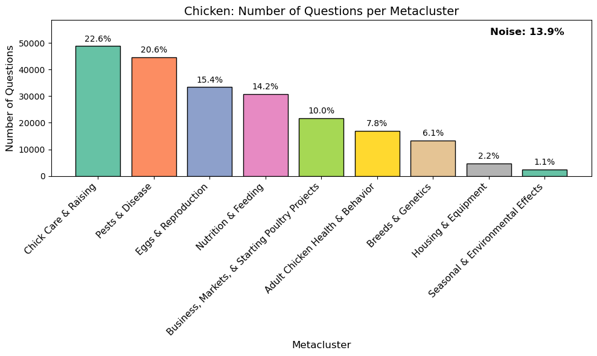
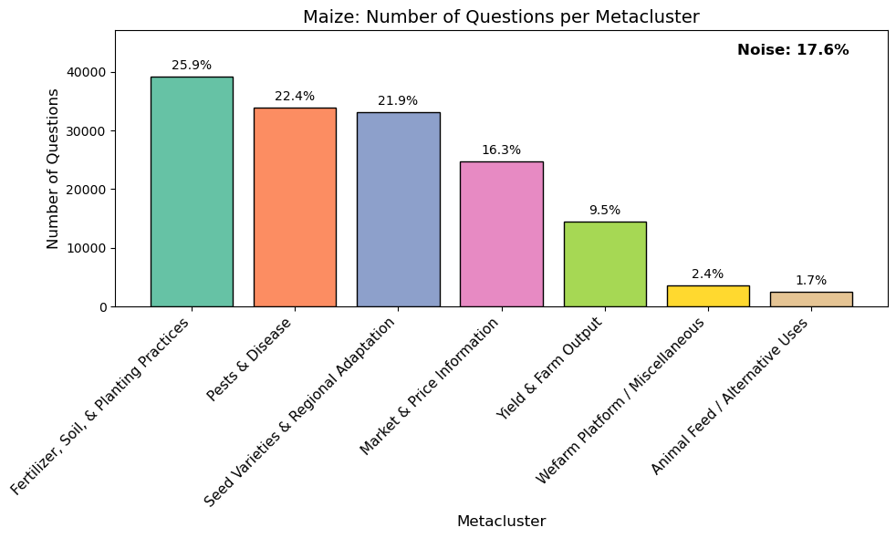

# DataKind - Smallholder Farmers DataKit - Clustering Analysis
**Author:** Brandon Rugg  
**Date:** November 2025

## Introduction
Producers Direct is a nonprofit organization that supports a 1M+ network of smallholder farmers in efforts to build more sustainable and profitable farms in South America and Africa. Previously, producers Direct acquired a large dataset from WeFarm, an SMS-based platform that operated for 7 years before going bankrupt in 2022. This 7GB dataset consists of over 5M questions, 16.2M responses, and extensive metadata for each message.

In November 2025, DataKind launched a month-long initiative to help Producers Direct determine what actionable information can be obtained from these farmer-to-farmer SMS messages. Insights gathered will hopefully aid Producers Direct in reestablishing a peer-to-peer network for smallholder farmers.

Main Project Repo: https://github.com/datakind/datakit-smallholder-farmers-fall-2025  
Project Brief: https://docs.google.com/document/d/1jKTmb8R5GlM9uqQkB5fXd37o2bdX17JKB36mK-NqWFE/edit?tab=t.0

## Project Goal
This subset of the November 2025 DataKit focuses on learning how the platform was used-- in other words, what were the farmers asking? There are already approximately 150 topic tags included in the data, but all of them are related to specific types of crops or livestock, as shown in this bar plot of the top 20 most common question tags:


There is undoubtedly a lot of structure that these tags aren't covering.
* The top 3 tags account for 24% of the questions, and 1,537,291 questions (another 28% of the data) are not tagged at all.
* Questions have at most one tag.
* There are no tags for things like finance, planning, farm equipment, or questions about how the WeFarm platform worked.

I performed a clustering analysis to see if I could uncover common topics the farmers were asking about, so that Producers Direct could make sure the needs of the farmers are being met moving forward. More in depth topic labeling may also help uncover patterns in seasonality, recognize domain experts, and identify common financial inclusion related topics. This analysis focused on questions in English, which constitute slightly more than half of the dataset.

<div style="text-align: center;">
  
</div>

## Clustering Pipeline Description

Early attempts at a global analysis of all English questions were not very successful. I eventually settled on a pipeline to cluster three topics independently: questions tagged with **'None'** (unlabeled), **'chicken'**, and **'maize'**. The latter two were chosen because they are the two most common topic tags for English questions, and represent an example of a crop and livestock (all question tags in the dataset appear to be one or the other).

The pipeline begins with minimal text cleaning, removing some common prefixes (e.g., `"Q:"`) and normalizing whitespace. Sentence embeddings are generated using the `all-MiniLM-L6-v2` model.

For clustering, UMAP reduces the embeddings to 5 dimensions, which are then fed into HDBSCAN to identify clusters. To better classify questions initially labeled as noise (`-1`), a second HDBSCAN pass is applied to the noise cluster, and the resulting clusters are manually verified and reintegrated.

This analysis typically resulted in over 100 clusters. Adjusting the parameters, I would either see even more clusters, or only a few very large ones (usually less than 5) that did not seem very cohesive. So, to make the results more understandable, I came up with about 10 metacluster topics and submitted short summaries of the clusters (including TF-IDF based keywords and 5 example questions) in batches to be evaluated and labeled by ChatGPT. These batches were about 40-50 questions long and prefixed with the prompts found in `/notes/LLM_prompts.txt`.

Finally, a 2D UMAP projection is generated solely for visualization of the clusters. 2D projections of the clusters along with metacluster topic counts and previews of the clusters are generated in `/notebooks/final_analysis.ipynb`. This notebook will also reassemble the clustered data from the original 7GB dataset and a set of files (18MB) contained in `/data`, allowing future users to continue the analysis or combine the labeling with insights from other contributors.

## Key Findings

Clustering subsets of the questions revealed more detailed patterns in how farmers were using the platform beyond what specific crops/livestock were of concern.

### **Unlabeled** Questions
Questions in this category seemed to be of at least slightly lower quality than the tagged questions I examined. However, it was evident that many users had concerns that were not addressed by the pre-existing question tags, including topics such as:
 - General Farm questions - equipment, irrigation, starting a farm, term definitions (e.g. organic farming))
 - Markets / Profitability
 - Fertilizer
 - Soil conditions (pH / chemistry, erosion, irrigation)
 - Vaccines
 - Food
 - Seeds
 - Pests & pesticides (fall armyworms seem like a common problem)
 - WeFarm platform (joining, leaving, competitions)
 - Disease
 - Weeds & herbicides
 - Weather
 - Personal conversation (sports, banter, romance / human sexuality)  

<br>



The **Animal Husbandry** metacluster contained a lot of questions on chickens and cows/cattle (two common tags) that probably weren't flagged because the questions were focused on terms like 'dairy' and 'eggs'. However, examination of the metacluster does show that users frequently asked more general questions on animal care. Personal communication about random topics also makes up a sizeable portion of the data.

### Chicken Questions
Clustering the most common livestock category revealed the top concerns about chickens were **Chick Care & Raising**, **Pests & Disease**, and **Eggs & Reproduction**. While the **Chick Care** metacluster did have some problems with overlap with other categories, it did seem to be a common legitimate concern. The size of this metacluster was increased by the presence of the largest single cluster focused on *vaccination*. This cluster included 11,000 questions-- more than any other well-defined topic in this subset.



### Maize Questions
Maize represented the largest 'crop' tag. The clustering and metaclustering proved more well-resolved than the other two categories-- in addition to the **unlabeled** category being inherently noisy, perhaps plant care is more straightforward than animal care. In addition to general growing advice, many users display concern over market prices, regional adaptation, pests, and disease. Fall armyworms and leaf yellowing seem to be common problems.



### Conclusions
Despite noisy question text (including misspellings, regional dialects, and broad or ambiguous questions) UMAP + HDBSCAN clustering produced remarkably coherent clusters. The ChatGPT-mediated metaclustering is imperfect and not entirely reproducible, but makes it easy to identify broad patterns in the questions being asked-- though I would strongly recommend personally inspecting the raw clusters for a better perspective on question patterns.

If Producers Direct develops a similar platform, I recommend using a two-part topic tag—essentially `(animal or crop)/(problem)`—for example:

- `chicken/disease`
- `maize/fertilizer`
- `cattle/reproduction`

More general subject tags, such as `finance` or `equipment`, could also be helpful.


Compared to the 10s of 1000s of uses of the most popular tags, many are barely used. The bottom 10 tags:
- apricot: 29
- blackberry: 21
- lupin: 20
- vetch: 20
- rye: 19
- leucaena: 17
- setaria: 15
- mulberry: 13
- purple-vetch: 7
- cranberry: 3

Collapsing these infrequently used tags into broader categories could improve organization and make tagging more consistent. 

## Recommended Next Steps / Project Limitations

Clustering embeddings generated by `all-MiniLM-L6-v2` using UMAP + HDBSCAN worked surprisingly well. Generating the embeddings took roughly an hour for batches of around 1M questions, and should scale linearly, so it could be applied to the entire dataset. The UMAP + HDBSCAN clustering step took longer for larger batches, but applying it globally offered limited insight. Focusing on the top 10 or so question tags individually could yield interesting patterns and would not take long.

Metaclustering was applied to address overlapping clusters in the raw output-- for example, many clusters about egg laying appeared when analyzing the **chicken** questions. While metaclustering helps provide a clearer view of the most common question topics, it is prone to human subjectivity and LLM quirks. Reapplying it to other topics is likely unnecessary; inspecting sample questions from the largest raw clusters already provides a useful perspective, though summarizing these patterns concisely remains challenging. In any case, the biggest clusters show common topics of concern. Inspection may reveal for example, what pests people are most often concerned about, as well as how they talk about them (including common mispellings). 

Some of the clusters may be useful in exploring other aims of the project. For example, the **Finance & Loans** metacluster of the **unlabeled** data is clearly related to financial inclusion. Investigating seasonality of specific clusters may also prove interesting, particularly for clusters related to specific pests & diseases, or planting of specific crops.

## How to Run This Analysis
This project uses several Jupyter notebooks, though only `final_analysis.ipynb` is necessary for exploring the results. Make sure to properly modify `.env` to ensure proper functioning, or otherwise supply proper file paths. 
- `final_analysis.ipynb`: Attaches cluster labels to original dataset using lightweight files in `/data` and summarizes results. It should run smoothly as long as the proper path to the full dataset is supplied. Contains tools to inspect individual clusters by supplying a specified number of sample questions and giving a list of TF-IDF based keywords.
- `clustering_questions_unlabeled.ipynb`: Runs UMAP + HDBSCAN clustering + ChatGPT metaclustering analysis on **unlabeled** questions and contains some experiments in figure generation.
- `clustering_questions_coretopics.ipynb`: Runs UMAP + HDBSCAN clustering + ChatGPT metaclustering analysis on **chicken** and **maize** questions.
- `clustering_questions.ipynb`: Includes experiments with fitting all English questions with TF-IDF along with UMAP + HDBSCAN clustering
- `parquet_conversion.ipynb`: Converts original 7GB .csv to 2GB .parquet file. Also includes some exploratory data analysis on # of unique questions, question tags, etc.
- `exploring.ipynb`: Very preliminary exploratory data analysis-- probably made redundant by other notebooks.

## Project Directory
```text
BKR_question_clustering_analysis/
├── README.md (this file)
├── requirements.txt
├── .env.example
├── notebooks/
│   ├── final_analysis.ipynb
│   ├── clustering_questions.ipynb
│   ├── clustering_questions_coretopics.ipynb
│   ├── clustering_questions_unlabeled.ipynb
│   ├── parquet_conversion.ipynb
│   └── exploring.ipynb
├── src/
│   ├── cleaning.py
│   ├── clustering_analysis.py
│   └── processing_and_visualization.py
├── figures/
│   ├── unlabeled_metaclusters_bar.png
│   ├── chicken_metaclusters_bar.png
│   ├── maize_metaclusters_bar.png
│   ├── question_languages.png
│   └── topic_tags.png
├── notes/
│   ├── LLM_clusterassignments_unlabeled.txt
│   ├── LLM_clusterassignments_chicken.txt
│   ├── LLM_clusterassignments_maize.txt
│   └── LLM_prompts.txt
└── data/
│   ├── question_clusters_unlabeled.parquet
│   ├── question_clusters_chicken.parquet
    └── question_clusters_maize.parquet
```
## Use of Generative AI

### ChatGPT
Used to brainstorm ideas, generate code for repetitive tasks (e.g., figure generation), format functions according to PEP 8, troubleshoot code, and assist with metacluster labeling as described in the `Pipeline` section.

### GitHub Copilot
Used in VS Code to provide autocomplete suggestions and facilitate variable name modifications.

